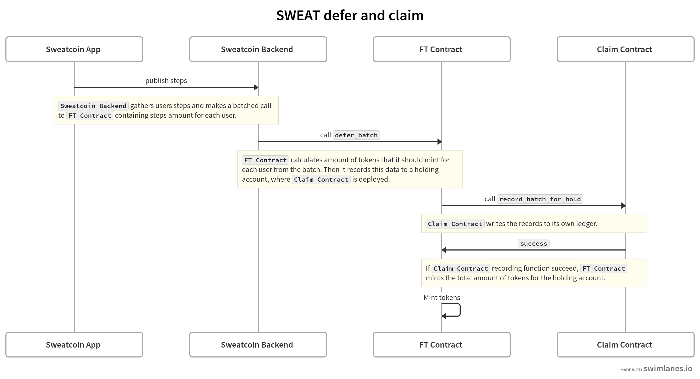

# sweat-claim

-------------------------------------


## Quickstart

1. Make sure you have installed [rust](https://rust.org/).
2. Install the [`NEAR CLI`](https://github.com/near/near-cli#setup)

If you already have `rustup` installed, you can ensure that the correct version of the compiler and the NEAR CLI is installed as well:

```shell
make install
```

### General information

To learn how to build the project, deploy it, and run tests run the following command:

```shell
make help
```

### Build and Deploy the Contract
First build the contract using provided `make` command:

```bash
make build
```

Then deploy and initialize it. Rename `dev.env.example` to `dev.env` and define variable values there. To deploy the contract to dev-account on Testnet use the following command:

```bash
make deploy
```

Once finished, check the `neardev/dev-account` file to find the address in which the contract was deployed:

```bash
cat ./neardev/dev-account
# e.g. dev-1659899566943-21539992274727
```

### Reproducible build

If you build your contract on two different machines, it's highly likely that you'll obtain two binaries that are
similar but not exactly identical. Your build outcome can be influenced by various factors in your build environment,
such as the locale, timezone, build path, and numerous other variables.

To obtain an identical build artifact on any machine, matching the one deployed on NEAR, you can build it using Docker:

```shell
make build-in-docker
```

# Use case
## Introduction
The claim feature is an extension of the [Sweat Wallet](https://sweateconomy.com/#) application and aims to safely store the $SWEAT minted for a given users based on their steps provided by the [Sweatcoin Oracle](https://sweatco.in/) and converted to $SWEAT as per the token's [minting curve](https://sweateconomy.com/token). 

Prior to this "claim" feature, $SWEAT accrued from steps was calculated several times per day as determined by the Sweatcoin Oracle and $SWEAT was minted accordingly by the [`token.sweat` ](https://nearblocks.io/address/token.sweat) contract and transferred to the given user's wallet address. The goal of the "claim" feature is to given the user more control over their $SWEAT earned from walking. This is accomplished by diverting minted $SWEAT to a new contract where it will accrue until a user claims it. 

The contract furthermore caters for edge cases in user behaviour which current places the Sweat economy at risk. E.g. If a user churns and disbands the project then there should be a mechanism to recover $SWEAT that was minted to a user's address but abandoned by the user. Currently this is impossible as Sweat Wallet is a self-custody thereby rendering complete control of funds to the user. Having a contract where minted $SWEAT accrues provides a degree of separation in terms of ownerships rights /control of minted $SWEAT. Sweat Wallet may therefore impose a condition that $SWEAT which is not claimed after a set amount of time may be burned from the claim contract. This will not only create a healthier economy (supply vs demand) but furthermore provide a method for maintaining an efficient contract size.

## User Stories
The following users provide some context as to how users will interact with the contract from the Sweat Wallet application. 

### Server side

-------------------------------------

1. As a server I want to impose a 48 hour count down time (offchain) which prevents the "Claim" button from being active. After the 48 hours have matured, the Claim button should be shown as active such that a user may interact with it.
2. As a server I want to inform a user based on internally stored thresholds, when $SWEAT that has accrued has not been claimed after _x_ days and/or _y_ amount. This may be accomplished by push notifications in-app.
3. As a server I want to be alerted when a user has not claimed for 30 days and inform the user that the `burn` method will be invoked in the contract for the server to request to burn accrued $SWEAT that has not been claimed for more than 30 days.
4. As a server I want to regularly monitor contract storage size and evaluate Sweatcoin Oracle data to optimize data entries into the claim contract.
5. As a server I want to limit contract interaction by requiring an active Sweat Wallet UUID that matches a valid keypair to prevent access to the contracts function from independent users (users not using an active Sweat Wallet session)

### Client side

-------------------------------------

1. As a user I want to view my accrued $SWEAT in-app
2. As a user I want to see a progress bar showing how much time is remaining (of the 48 hours) before I can access the Claim button.
3. As a user I want to view claimed $SWEAT in my Available Balance as soon as a successful claim has been initiated.
4. As a user, after claiming, I want to see the countdown timer and associated progress bar reset.
5. As a user I want to be notified when any $SWEAT get burned from my associated associated address in the claim contract.
6. As a user I want to see the gas fee displayed before interacting in any way with the claim contract.
7. As a user I want to receive logical error messages when a contract interaction fails e.g. insufficient NEAR or $SWEAT to cover gas fees, etc. or any reason that causes the contract to panic.
8. As a user I want to receive notifications before an method is called in the claim contract by the server that affects my unclaimed balance in the smart contract (offchain functionality) 

# Implementation

## Interaction within the system


